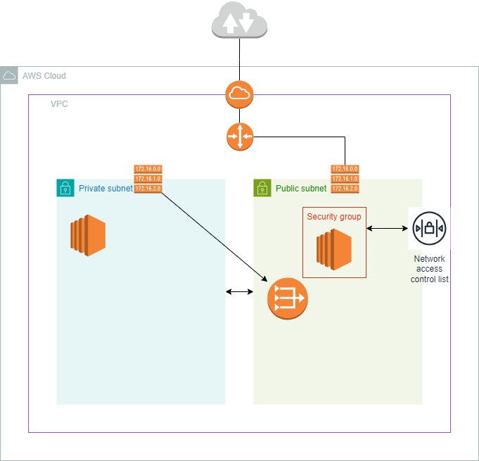
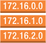

= AWS networking

This document introduces basic networking concepts in AWS, through a series of
practical steps that will build a virtual private cloud that looks like this:



== Virtual Private Cloud (VPC)

A *Virtual Private Cloud (VPC)* is like a private network to isolate a group
of resources that sit within it.

When you create a VPC, you will create an IPv4 *CIDR range*. A CIDR range is a
notation that specifies a range of IP addresses. Examples:

* 10.0.0.0/24
* 10.0.0.0/16
* 10.0.0.0/8

Each octet (the digits between the dots) can be between 0 and 254 – an 8-bit
integer. The number after the slash is the number of bits that are fixed
in the range. So if you see `/24` on the end, this means that the first three
octets (8 + 8 + 8 = 24) are fixed, and the last octet can be any number between
0 and 254. If you see `/16` on the end, it means the first two octets are locked,
and `/8` means only the first octet is locked.

|===
|CIDR range |Min IPv4 |Max IPv4

|10.0.0.0/24
|10.0.0.1
|10.0.0.254

|10.0.0.0/16
|10.0.0.1
|10.0.255.254

|10.0.0.0/8
|10.0.0.1
|10.255.255.254
|===

Inputting `10.0.0.0/16` for your CIDR range will give you 65,536 possible IP
addresses, in the range 10.0.0.1 to 10.0.255.254, which will be more than
sufficient for most networking requirements.

[TIP]
======
IP Subnet Calculator:
https://www.calculator.net/ip-subnet-calculator.html

image::./_/ipv4-subnet-calculator.png[]
======


== Subnets

Within a VPC you will have isolated networks called *subnets*. A subset is a
defined range of network IP addresses within a VPC's CIDR range.

Subnets are used to increase the security and efficiency of network
communications. You can think of them as postcodes, which help to more
efficiently route mail than could be achieved using just the street address
and city.

Subnets are created within a VPC.

image::./_/create-subnet.png[]

For each subnet you create within a VPC, you give the subnet a name, choose an
availability zone, and specify the subnet's IPv4 CIDR block, which must exist
within the IPv4 CIDRs for the VPC. In the below example, the IPv4 CIDR range of
the VPC is 10.0.0.0/16, while the IPv4 CIDR block for the subnet is 10.0.0.0/24.
It means for the subnet, only the last octet of the IP range can vary, so the
subnet's range is 10.0.0.1 to 10.0.0.254.


You can create one or more subnets within each VPC. What you will usually see
in a VPC is a public subnet and a private subnet. The public subnet will have a
route to the wider internet and its resources will therefore be accessible by
the public. The private subnet will encapsulate resources that you do not want
to be reachable directly from outside the VPC.

In the following settings for the private subnet, the subnet's IPv4 CIDR block
is set to 10.0.1.0/24. This means that the subnet's IP range is 10.0.1.1 to
10.0.1.254.


Another common pattern is to have, within each VPC, a public subnet and a
private subnet in one geographic zone, and a second public-private subnet pair
in a different zone. Therefore, if one zone goes down, you will have high
availability by having a second zone to failover to.

== Launching instances

Resources are launched into subnets. When you launch a resource, you will need
to specify the subnet you want it to be launched into.

The AWS networking diagram above shows an EC2 instance launched in the public
subnet. To do this, go to *EC2* > *Launch instance*.

image::./_/launch-ec2-instance.png[]

Choose a system image, instance type, and create a public-private key pair if
you do not already have one you can reuse.

Under *Network settings*, choose your VPC, and then choose the subnet you want
to launch the instance into. For public instance, you want to choose the option
to enable *auto-assign public IP*. Configure firewall settings by creating or
reusing a security group. For most public resources, you will at least want an
"ssh" security group rule from "anywhere".

image::./_/launch-ec2-instance-network-settings.png[]

[NOTE]
======
A *security group* is a virtual firewall that controls the traffic to and from
your instances. It is a set of rules that filter traffic based on IP protocol,
port, and source/destination IP address.
======

Click *Launch instance*. You now have an EC2 instance running in your public
subnet.

image::./_/ec2.png[]

== Gateways

Once a new instance is running inside a subnet, you can select the instance from
the list of EC2 instance and then click *Connect*. Choose *EC2 Instance Connect*
to connect to the instance using the browser-based SSH client. The connection
should not work – the expected outcome is an error messages saying "Failed to
connect to your instance".

The reason is there is no route from the internet to the instance.

Resources created within different subnets within the same VPC can communicate
with each other automatically. This is the default behavior. This private
traffic between a VPC's subnets is represented by the two-way arrows in the
network diagram at the top of this diagram. But to allow public access into a
subnet and its resources, you need to create a gateway, specifically an
*internet gateway*, which is represented by this symbol:

image::./_/internet-gateway.png[]

[NOTE]
======
A gateway, in general, connects one computer network to another computer
network. An internet gateway connects a computer network to the internet.
Other types of gateways include transit gateways and NAT gateways.
======

To crete an internet gateway, go to *VPC* > *Internet gateways* > *Create
internet gateway*. Give the gateway a name, and then click *Create internet
gateway*. You can only have one internet gateway per VPC.

image::./_/create-internet-gateway.png[]

Once the internet gateway is created, you need to attach it to the VPC. Select
the internet gateway, and then click *Actions* > *Attach to VPC*. Choose the VPC
you want to attach the gateway to, and then click *Attach internet gateway*.


== Route tables

If you try again to SSH into the EC2 instance... it still won't work. This is
because the subnet does not have a route to the internet gateway. You then need
to give the public subnet a *route* to your internet gateway. This is done using
something called a *route table*, which has this symbol:



And this is the symbol for a router. Every VPC has a router by default, so you
don't need to explicitly set up a router. You only need to set up route tables
for the subnets.

image::./_/router.png[]

To do that, from the *VPC* dashboard go to *Route tables*. All VPC's come with
default route tables, which will be listed here. The default route table is
called the *main route table*. All unassociated subnets use the main route
table. If you select the main route table and then view the routes within it,
you will see that it has a route to the local VPC CIDR range. This is how all
resources within a VPC can communicate with each other by default.


For the main route table, if you look under the *Subnet associations* tab, you
will see that there are no explicit subnets associated with the main route
table. This is because all subnets are associated with the main route table by
default. Any subnet that is not explicitly associated with another route table
will use the main route table.

We want to create separate route tables for our public and private subnets. We
don't want to use the default main route table for this purpose, because we
don't want to treat our public and private subnets the same way in terms of
routing.

Create two new route tables, one "public" and one "private", and both associated
with the VPC.


Route tables belong to VPCs, but each route table is associated with one or more
subnets within that VPC. Select the public route table, and associate it with
the public subnet. Repeat for the private route table and the private subnet.

To add a route between the public subnet and the internet gateway, we can now
add a route to the public route table. Select the public route table, and then
click *Routes* > *Edit routes*. Add a new line to the route table. For the
destination, we want to allow everything, so enter the value `0.0.0.0/0`. This
value covers all IP addresses - including those outside of the VPC's own CIDR
range (which is used for internal traffic).

For the target, select *Internet gateway*, and then choose the internet gateway
you created earlier. Click *Save changes*.

Now, if you try to SSH into the EC2 instance, it should work. This proves that
you have public access to the instance via SSH. Try running a command like
`sudo yum update -y`.

== NAT gateways

Repeat the steps above to launch an EC2 instance into the private subnet. This
time, do not enable *auto-assign public IP*. Create a new security group for
private resources, but allow SSH access as before.

Next, to SSH from the public EC2 instance to the private EC2 instance, you will
need to upload a key pair to the public EC2 instance. You can do this using the
following command:

```bash
sudo scp -i /Users/<name>/Downloads/your-key.pem /Users/<name>/Downloads/your-key.pem ec2-user@52.203.200.115:/home/ec2-user
```

The IP address is the assigned IP address for the public EC2 instance.

Now you can SSH into the public EC2 instance from your local machine, and then
SSH into the private EC2 instance from the public EC2 instance – using the same
key pair both times.

Check the PEM file is in the public EC2 instance:

```bash
cd /home/ec2-user
ls
```

Get the IP address for the private EC2 instance from the AWS Management Console,
then run the following command from the public EC2 instance CLI:

```bash
ssh -i your-key.pem ec2-user@<ip-address>
```

Now, from the context of the private server, try updating the system packages:

```bash
sudo yum update -y
```

This will fail, because the private subnet does not have a route to the internet
gateway. To allow the private subnet to access the internet, you need to create
a *NAT gateway*.

A NAT gateway allows resources to reach out to the internet, but disallows
incoming traffic from the internet. A NAT gateway is a network address translation
(NAT) service that allows instances in a private subnet to connect to the internet,
or other services outside the VPC, but external services cannot initiate a
connection with those instances.

To create a NAT gateway, you will actually create it in your public subnet,
because the public subnet has a route to the internet gateway. And then you
will use your private route table to create a route to that NAT gateway.

From the VPC dashboard, go to *NAT gateways* > *Create NAT gateway*. Give it a
name, choose the public subnet, set the connectivity type to public, and click
the button to generate an elastic IP address. Click *Create NAT gateway*.

image::./_/create-nat-gateway.png[]

Next, go to *Route tables*, select your private route table, and add a route
out to the new NAT gateway. For the destination, allow everything as before
(`0.0.0.0/0`), and for the target, select the NAT gateway you just created.

The NAT gateway takes a few minutes to become available. Once it is available,
try again to SSH into the private EC2 instance from the public EC2 instance,
and then try updating the system packages. This time, it should work.

== NACLs and security groups

Network access control list (NACL) is like a virtual firewall that protects a
whole subnet, controlling traffic in and out of it. It's another layer of
protection around a subnet.

A NACL is stateless, so if you allow some traffic in to the subnet, it doesn't
remember that state and automatically allow it back out. You must have a
corresponding outbound rule.

Most people leave the NACL in its default configuration, which is to allow all
traffic in and all traffic out. Often, that's sufficient security, because you
already have routes and security groups.

One thing people do use NACLs for is to block an IP address at the subnet level.
That's a good use case for NACLs. But normally you just leave the defaults but
it's there as an added layer of protection if you need it.

A NACL protects a subnet, but once a communication gets through the NACL, you
have security groups that protect the individual resources within the subnet.
Every EC2 instance gets associated with a security group.

Unlike a NACL, a security group is stateful. If some traffic is allowed through
by an inbound rule, its going to remember that state and allow the response out.
