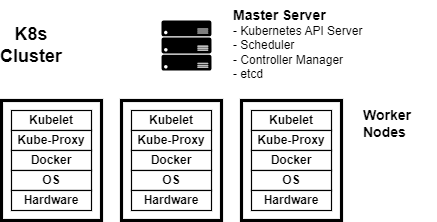

= Kubernetes

Kubernetes is an open-source container orchestration platform that automates the
deployment, scaling, and management of containerized applications. It was
originally developed by Google.

Setting up a K8s cluster is a bit of work, but most public cloud providers
automate the process.
